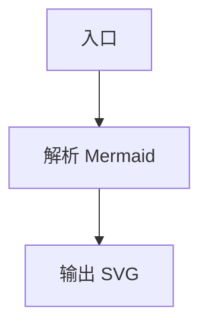
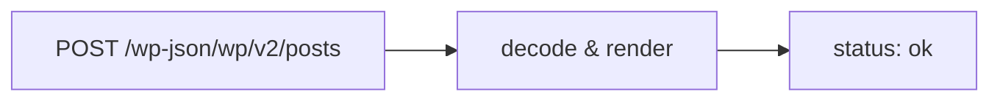
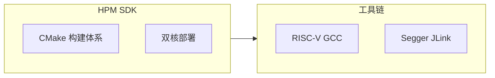
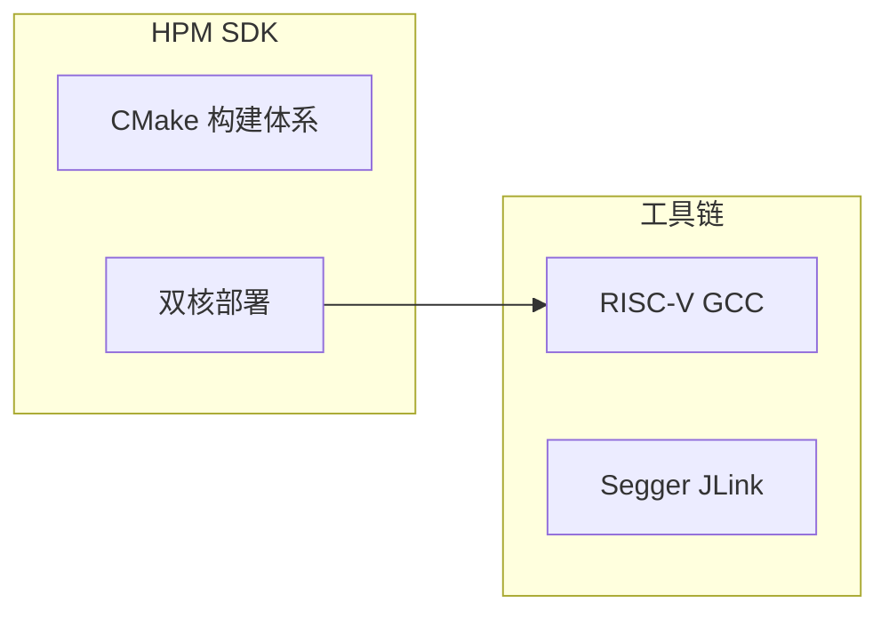
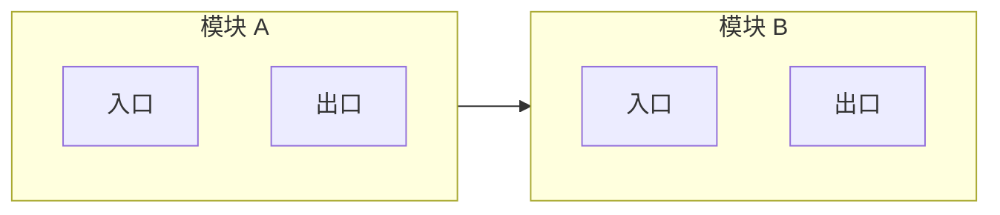

# Sakurairo 技术文章图表写作方案

适用组合：
- `babel-arcaea-code`：前台统一渲染层
- `WP Githuber MD`：Markdown 写作
- `MerPress`：Gutenberg Mermaid 块
- `Sakurairo`：主题、样式和 PJAX

## 目标

统一原则是：**编辑器保持原样，前台渲染统一收敛到 `babel-arcaea-code`**。

```text
Githuber MD / MerPress
        ↓
WordPress 保存 HTML
        ↓
babel-arcaea-code
  ├── Mermaid
  ├── Markmap
  ├── 特殊字符清洗
  └── PJAX 重扫
        ↓
Sakurairo 前台显示
```

## 推荐写法

## 当前支持语法

前台统一由 `babel-arcaea-code` 接管时，当前实际支持的是：

- Mermaid 代码块：` ```mermaid `
- Mermaid 短代码：`[mermaid]...[/mermaid]`
- MerPress 前台输出：裸 `pre.mermaid`
- Markmap 代码块：` ```markmap `、` ```mindmap `
- Markmap 短代码：`[markmap]...[/markmap]`、`[mindmap]...[/mindmap]`
- LaTeX 代码块：` ```katex `、` ```latex `、` ```mathjax `、` ```tex `
- LaTeX 短代码：`[latex]...[/latex]`
- KaTeX 短代码：`[katex]...[/katex]`

注意：

- 编辑器内不保证最终前台样式
- 前台是否真正启用，还取决于 `babel-arcaea-code` 设置页里的模块开关

### Mermaid

````markdown

````

若节点文本里有 URL、括号、冒号、`#`、`&`、引号等特殊字符，放进带引号的标签文本：



#### Mermaid 兼容模式

插件设置页现有三档：

- `关闭`
- `自动（推荐）`
- `强制开启`

用途是处理 Sakurairo 下最容易出问题的一类图：



在 `自动/强制开启` 时，前台会把 `subgraph -> subgraph` 连线改写成“前一个子图的末节点 -> 后一个子图的首节点”。

因此写作建议是：

1. 最稳妥的写法仍然是直接连节点，不连 `subgraph` 标题
2. 如果为了语义清楚必须写 `subgraph -> subgraph`，建议站点开启 `自动`
3. 旧文章里大量使用这类图，建议先临时切到 `强制开启` 做回归

#### 推荐稳定写法

````markdown

````

#### 需要谨慎的写法

````markdown

````

### Markmap

````markdown
```markmap
# Sakurairo Render Layer
## Githuber MD
- Markdown source
## Babel Arcaea Code
- Mermaid
- Markmap
## Sakurairo
- PJAX
```
````

### MerPress

- 编辑器继续使用 MermaidJS block
- 不要求编辑器内就拥有 Sakurairo 玻璃风格
- 前台由 `babel-arcaea-code` 自动包裹与重渲染

## 特殊字符规则

前台兼容层会自动清洗：

1. HTML entities：`&lt;` `&gt;` `&amp;` `&quot;`
2. 零宽字符：`U+200B` ~ `U+200D`、`U+FEFF`
3. `NBSP`：`&nbsp;`
4. 常见弯引号：`“”‘’`

作者仍应遵守：

1. Mermaid 结构语法使用 ASCII：`-->`、`[]`、`()`、`{}`、`:`、`;`
2. 特殊字符优先放在节点文本里，不要混进结构位
3. 引用和 Retrieved 日期不要写进 Mermaid 代码块
4. 不要用全角括号、全角冒号充当 Mermaid 语法
5. 含 URL、接口、Header、JSON key、状态码的文本，优先写进 `["..."]`
6. `subgraph` 内如果要控制排布，优先显式写 `direction LR` 或 `direction TB`

### LaTeX

KaTeX 推荐代码块：

````markdown
```latex
\int_0^1 x^2 \\, dx = \\frac{1}{3}
```
````

MathJax 代码块：

````markdown
```mathjax
\\mathbf{F} = m\\mathbf{a}
```
````

短代码：

```text
[latex]\\int_0^1 x^2 \\, dx = \\frac{1}{3}[/latex]
[katex display=1]c^2 = a^2 + b^2[/katex]
```

## 文章结构建议

推荐布局：

1. 引言后插一张 Mermaid 总览图
2. 章节开头插局部流程图 / 状态图 / 时序图
3. 文末用 Markmap 做总结图

```text
引言
  ↓
Mermaid 总览图
  ↓
正文
  ↓
代码块 / 表格 / 引用
  ↓
Markmap 总结图
```

## 发布前检查

1. 页面源码中的 Mermaid 为 `pre.mermaid` 或已被 BAC 包裹
2. 页面源码中的 Markmap 仍保留 `.arcaea-markmap-source`
3. LaTeX 块被输出为 `.bac-latex-block`
4. PJAX 切页后图表仍能渲染
5. 特殊字符没有以实体文本形式直接显示
6. 引用文本没有混入 Mermaid 代码块
7. 含 `subgraph -> subgraph` 的图在当前站点设置下已实测正常
