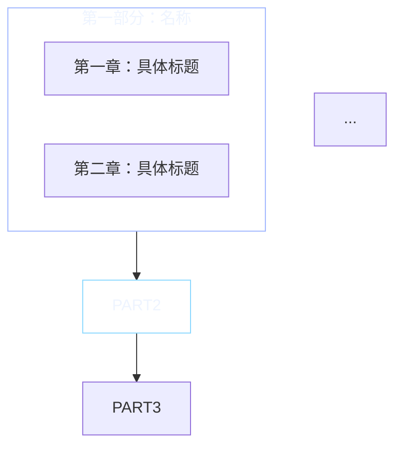

# Arcaea 技术文章写作工作流

## 两篇成熟文章的结构反推

以下分析来自生产仓库中两篇已发布的合格文章：
- `STM32 CMake 工程实践 — 从 CubeMX 到分层架构.html`（70KB, 12 章, 30 节）
- `.HPM SDK 开发手册.html`（138KB, 12 部分, 48 章）

### 通用结构模板

```
[CSS 块]                          → 7 个 --arcaea-* Token + .arcaea-article-content 样式
[文章正文]                         → <div class="arcaea-article-content">
  [开头故事]                       → 1-2 段真实工程经历 + CI 故障/现场问题
  [三个目标问题]                    → "读完文章你应该能回答三个问题"
  [Mermaid 架构总览图]              → graph TB/TD 总览全文结构
  [正文部分]                       → 8-14 个 H2 章节
    [章节开头]                     → "为什么 X" / "X 的工作原理" / "X 的内部实现"
    [代码摘录]                     → <pre><code class="language-xxx"> + 文件路径标注
    [对比表格]                     → <table>
    [设计意图解释]                  → 紧跟代码块后的 2-4 段分析
  [关键约束表]                     → 最后一章前的 <table>
  [结语]                          → 1-2 段总结
```

### 开头故事的模式语言

两篇合格文章的开头使用相同的叙事结构：

**模式 1：从具体项目切入（STM32 文章）**
```
<p>2019 年接手一个 STM32F103RCT6 的工业控制项目。接手时仓库里有 6 个 .c 文件和一份 Keil .uvprojx...</p>
<p>两年后，同一个仓库膨胀到 200+ 个源文件...</p>
<p>真正促使迁移的是一次 CI 故障...</p>
```
三段式：项目初始状态 → 膨胀后的问题 → 某个具体故障事件（催化剂）。

**模式 2：从矛盾切入（HPM 文章）**
```
<p>去年帮一个团队从 STM32F407 迁移到 HPM6880，对方提了两个要求：第一，CANFD 不能丢帧；第二，LVGL 要跑满 60fps。
在 STM32 上，这两个需求几乎冲突...</p>
```
一段式：对方要求（矛盾点）→ 现有方案做不到（冲突）。

**两种模式通用要素**：
1. 真实项目背景，有具体芯片型号和参数
2. 量化问题的严重程度（6→200 文件 / 两个明确要求）
3. 在第二段点出「真正」两个字，标识催化剂事件
4. 不使用「概述」「简介」等抽象标题

### 三个目标问题的写法

每篇合格文章在开头故事后固定跟三个问题：

```html
<p>读完这篇文章，你应该能回答三个问题：</p>
<ul>
  <li><strong>从 CubeMX 到 CMake 的迁移路径是怎么走的</strong>——不仅仅是「改个构建系统」</li>
  <li><strong>三层分层架构的 CMake 实现</strong>——不仅仅是「分三个文件夹」</li>
  <li><strong>从原型到量产的构建系统长什么样</strong>——不仅仅是「能编译通过」</li>
</ul>
```

模式：`<strong>可验证的技能点</strong>——不仅仅是「新手会犯的表面认知」`。

错误示范（`stm32-cmake/post.md`）中这三个问题**被删掉了**——这是深度不足的直接原因。

### Mermaid 架构总览图规范

合格文章在开头故事和三个问题之后，固定放一个 Mermaid 总览图：



规则：
1. **subgraph 分组**：每个部分用一个 subgraph 包裹，subgraph 标题 = 部分名称
2. **节点格式**：`CH1["第一章：标题<br/>副标题"]` — 换行用 `<br/>`
3. **连线方向**：`PART1 --> PART2 --> PART3` 单向串联
4. **颜色分配**：按部分轮流使用 `#9db4ff`（冰蓝）、`#8ad8ff`（天蓝）、`#c7b6ff`（淡紫）、`#ff9191`（淡红）
5. **`style` 恒为**：`fill:transparent,stroke:{颜色},color:#eef4ff`

### 章节内部的节奏

每章从「为什么」开始：

```html
<h3>第九章：INTERFACE 库——stm32cubemx 层的设计</h3>

<pre><code class="language-cmake"># cmake/stm32cubemx/CMakeLists.txt
add_library(stm32cubemx INTERFACE)
target_include_directories(stm32cubemx INTERFACE ${MX_Include_Dirs})
target_compile_definitions(stm32cubemx INTERFACE ${MX_Defines_Syms})</code></pre>

<p>INTERFACE 库是 CMake 中没有源文件的库——它不生成 <code>.o</code> 文件，只传播属性...</p>

<p>为什么不用 STATIC + 空源文件？因为 STATIC 库即使没有源文件也会生成一个空的 <code>.a</code> 归档文件...</p>
```

节奏：**代码块 → 解释设计意图 → 回答隐含疑问（为什么不用别的方式）**。

代码块在段落之前，而不是之后。读者先看到源码再读解释。错误示范把代码块放在段落之后——顺序反了导致阅读体验卡顿。

### 代码摘录的路径标注规则

合格文章的代码块的第一行或标题中标注文件路径：

```html
<pre><code class="language-cmake"># cmake/stm32cubemx/CMakeLists.txt
add_library(stm32cubemx INTERFACE)
```

```html
<pre><code class="language-bash"># .github/workflows/build.yml（核心步骤）
cmake --preset Debug
```

```html
<p>入口文件：<code class="language-text">cmake/gcc-arm-none-eabi.cmake</code>。</p>
```

文件路径标注有三种格式：
1. 代码块内首行注释：`# path/to/file`
2. 文字段落中的 `code` 标签：`入口文件：<code>path/to/file</code>`
3. 代码块标题行：`.github/workflows/build.yml（核心步骤）`

错误示范中**没有任何代码标注文件路径**——读者无法判断代码是来自真实项目还是伪代码。

### 对比表格的写法

合格文章每章至少有一个对比表格：

```html
<table>
  <tr><th>约束</th><th>为什么重要</th></tr>
  <tr><td>Git 检出后两次命令即可构建</td><td>新人加入零配置时间</td></tr>
  <tr><td>本地和 CI 使用相同 Preset</td><td>消除「CI 上能过、本地不能」</td></tr>
</table>
```

表格列数固定为 2-3 列。第一列是名词/概念，第二列是解释/原因。禁止使用「特点/说明」这种模糊表头，必须用具体的问题域术语。

### 关键约束/经验陷阱模式

合格文章在倒数第二章或最后一章放一个总结性表格：

```html
<h2>关键约束</h2>
<table>
  ...
</table>
```

或者分点列出陷阱：

```html
<ul>
  <li><strong>GLOB_RECURSE 的缓存问题</strong>——需要 <code>CONFIGURE_DEPENDS</code> 参数</li>
  <li><strong>Newlib-nano 的浮点 printf</strong>——<code>printf("%f")</code> 输出 0.000000</li>
</ul>
```

错误示范**完全没有陷阱章节**，直接以结语结束。

### 文章结尾模式

合格文章的结尾不超过两段：

```html
<h2>结语</h2>
<p>STM32 的 CMake 体系核心就是四个文件：工具链文件告诉编译器在哪、CMakePresets 告诉构建怎么配、
各层 CMakeLists.txt 告诉代码怎么分、Linker Script 告诉内存怎么用。
理解这四块的工作原理，比记住 IDE 界面上几百个配置项更持久。</p>
```

模式：**一句话概括四个核心要素 → 与 IDE 模式对比作为收尾**。不做未来展望、不写行动计划、不做情感号召。

---

## 正确文章模板（可直接复用）

```html
<style>
    :root {
        --arcaea-bg: rgba(8, 21, 42, 0.42);
        --arcaea-border: rgba(230, 238, 255, 0.78);
        --arcaea-border-strong: rgba(226, 236, 250, 0.46);
        --arcaea-heading: rgba(238, 244, 255, 0.96);
        --arcaea-accent: #9db4ff;
        --arcaea-text: rgba(238, 244, 255, 0.94);
        --arcaea-muted: rgba(238, 244, 255, 0.65);
    }

    .arcaea-article-content {
        position: relative;
        z-index: 1;
        max-width: 100%;
        color: var(--arcaea-text);
    }

    .arcaea-article-content h2 {
        color: var(--arcaea-heading);
        font-size: 1.65em;
        font-weight: 700;
        margin: 2em 0 0.6em;
        padding-bottom: 0.3em;
        border-bottom: 1px solid rgba(230, 238, 255, 0.40);
        text-shadow: 0 2px 10px rgba(0, 0, 0, 0.45);
    }

    .arcaea-article-content h3 {
        display: flex;
        align-items: center;
        gap: 10px;
        color: var(--arcaea-heading);
        font-size: 1.35em;
        font-weight: 700;
        margin: 1.5em 0 0.5em;
        text-shadow: 0 2px 10px rgba(0, 0, 0, 0.45);
    }

    .arcaea-article-content h3::before {
        content: "#";
        color: var(--arcaea-accent);
        font-size: 0.9em;
        font-weight: 700;
        flex-shrink: 0;
    }

    .arcaea-article-content h4 {
        color: var(--arcaea-accent);
        font-size: 1.1em;
        font-weight: 600;
        margin: 1.2em 0 0.3em;
        text-shadow: 0 1px 6px rgba(0, 0, 0, 0.35);
    }

    .arcaea-article-content h2::after,
    .arcaea-article-content h3::after {
        display: none !important;
    }

    .arcaea-article-content p,
    .arcaea-article-content li {
        line-height: 1.9;
        color: var(--arcaea-text);
    }

    .arcaea-article-content p { margin: 1em 0; }

    .arcaea-article-content code {
        font-family: "FiraCode Nerd Font", "Fira Code", Consolas, monospace !important;
        background: rgba(230, 238, 255, 0.10);
        padding: 0.2em 0.4em;
        border-radius: 4px;
        font-size: 0.9em;
        color: var(--arcaea-text) !important;
    }

    .arcaea-article-content pre,
    .arcaea-article-content pre.wp-block-preformatted,
    .arcaea-article-content pre.arcaea-code,
    .arcaea-article-content pre[class*="language-"] {
        box-sizing: border-box;
        max-width: 100%;
        font-family: "FiraCode Nerd Font", "Fira Code", Consolas, monospace !important;
        font-size: 15px;
        line-height: 1.7;
        white-space: pre;
        background: var(--arcaea-bg) !important;
        color: var(--arcaea-text) !important;
        border: 1px solid var(--arcaea-border);
        border-radius: 10px;
        backdrop-filter: blur(12px) saturate(130%);
        -webkit-backdrop-filter: blur(12px) saturate(130%);
        box-shadow: 0 12px 36px rgba(0, 0, 0, 0.22), inset 0 1px 0 rgba(255, 255, 255, 0.12);
        padding: 1.35rem 1.5rem;
        margin: 2rem 0;
        overflow: auto;
    }

    .arcaea-article-content pre code {
        display: block;
        min-width: max-content;
        background: transparent !important;
        padding: 0 !important;
        border-radius: 0;
        color: inherit !important;
        white-space: pre;
    }

    .arcaea-article-content table {
        display: block;
        max-width: 100%;
        overflow-x: auto;
        border-collapse: collapse;
        margin: 1.5rem 0;
    }

    .arcaea-article-content th,
    .arcaea-article-content td {
        border: 1px solid rgba(230, 238, 255, 0.25);
        padding: 0.65rem 0.85rem;
        color: var(--arcaea-text);
    }

    .arcaea-article-content blockquote {
        margin: 1.5rem 0;
        padding: 1rem 1.25rem;
        border-left: 4px solid var(--arcaea-accent) !important;
        background: rgba(230, 238, 255, 0.08) !important;
        border-radius: 8px !important;
    }

    .arcaea-article-content blockquote::before,
    .arcaea-article-content blockquote::after {
        display: none !important;
        content: none !important;
    }
</style>
<div class="arcaea-article-content">

    <h2>标题：从 ... 到 ...</h2>

    <p>真实工程故事开头...</p>
    <p>膨胀/恶化后的状态...</p>
    <p>真正促成改变的是一次...</p>

    <ul>
        <li><strong>可验证的技能点</strong>——不仅仅是表面认知</li>
        <li><strong>可验证的技能点</strong>——不仅仅是表面认知</li>
        <li><strong>可验证的技能点</strong>——不仅仅是表面认知</li>
    </ul>

    <pre><code class="language-mermaid">graph TB
        ...
    </code></pre>

    <!-- 12+ 个 H2 章节 -->

    <h2>关键约束</h2>
    <table>...</table>

    <h2>结语</h2>
    <p>一句话概括四个核心...与 IDE 模式对比作为收尾。</p>

</div>
```

---

## 错误示范对比分析（CSS + 内容）

### CSS Token 精确对比

```css
/* ========== 错误（stm32-cmake/index.html + stepper-s-curve/index.html） ========== */
:root {
  --glass-bg: rgba(8, 12, 20, 0.78);          /* α=0.78 → 几乎不透，背景太重 */
  --glass-light: rgba(10, 14, 24, 0.42);
  --glass-heavy: rgba(4, 8, 16, 0.88);
  --border-dim: rgba(255, 255, 255, 0.08);    /* α=0.08 → 在 #05070d 上不可见 */
  --border-glow: rgba(160, 220, 255, 0.16);    /* α=0.16 → 代码块边框太暗 */
  --accent-blue: #9db4ff;                      /* 命名偏离统一体系 */
  --text-primary: rgba(238, 244, 255, 0.96);   /* 三组 text-* 而不是 heading/text/muted */
  --text-body: rgba(238, 244, 255, 0.94);
  --text-muted: rgba(238, 244, 255, 0.65);
}
body::before { ... }  /* 全局光晕——不适合阅读页面 */
body::after { ... }   /* 同上 */
.arcaea-wrap { ... }  /* Hub 用 wrapper——不是 article wrapper */

/* ========== 正确（STM32 CMake 工程实践.html + HPM SDK 开发手册.html） ========== */
:root {
  --arcaea-bg: rgba(8, 21, 42, 0.42);          /* α=0.42 → 适度透光，阅读舒适 */
  --arcaea-border: rgba(230, 238, 255, 0.78);   /* α=0.78 → 在深色底上清晰可见 */
  --arcaea-border-strong: rgba(226, 236, 250, 0.46);
  --arcaea-heading: rgba(238, 244, 255, 0.96);
  --arcaea-accent: #9db4ff;
  --arcaea-text: rgba(238, 244, 255, 0.94);
  --arcaea-muted: rgba(238, 244, 255, 0.65);
}
/* 没有 body::before/after —— 阅读页不留全局光晕 */
.arcaea-article-content { ... }  /* 正确的 article wrapper */
```

**根本原因**：错误示范手写了一套完全不兼容 `visual-tokens.md` 的 CSS 变量体系。所有的 alpha 值选择缺乏对 `#05070d` 深色基底的考虑。

### 错误 CSS 在深色背景上的实际效果

```
在 #05070d 基底上：
  rgba(255,255,255,0.08) 的边框 → 亮度 = 5+0.08*255 ≈ 25，肉眼几乎分不清边框和背景
  rgba(160,220,255,0.16) 的边框 → 亮度 = 5+0.16*200 ≈ 37，太暗
  rgba(8,12,20,0.78) 的背景 → 透明度几乎 0，玻璃感消失

正确：
  rgba(230,238,255,0.78) 的边框 → 亮度 = 5+0.78*240 ≈ 192，清晰可见
  rgba(8,21,42,0.42) 的背景 → 透光适度，保留玻璃感
```

**教训**：在深色基底上，边框 alpha 必须 >= 0.25 才能被肉眼识别。`0.08` 和 `0.16` 纯粹是浪费流量——它们渲染出来的线条不可见。

### 内容深度精确对比

| 维度 | 错误（stm32-cmake/post.md） | 正确（STM32 CMake.html） |
|------|---------------------------|------------------------|
| 字数 | ~3000 字（170 行） | ~10000 字（1143 行） |
| H2 章节 | 5 个 | 12 个（每章 2-5 个 H3） |
| 代码块 | 有但未标文件路径 | 每段标注 `${project_root}/path` |
| 对比表格 | 1 个 | 5+ 个 |
| 陷阱章节 | 无 | 第十章「五个最常见陷阱」 |
| 开头故事三问题 | 删掉了 | 固定保留 |
| Mermaid 图 | 1 个（简单） | 1 个（带 subgraph 分组） |
| Newlib 细节 | 无 | 解释三种变体的区别和 Flash 增量 |

**错误示范删掉了开头故事后的三个目标问题**。这是一个诊断指标：如果一篇技术文章没有三个明确的可验证目标，它通常也不会有足够的深度来支撑它们。

---

## 中文排版规则

从 `tech-doc-style-chinese` 技能集成，针对 Arcaea 文章的场景做精简。

### 强制规则

1. **CJK/拉丁文间距**：中文与英文/数字之间加空格
   - ❌ `支持JSON格式` → ✅ `支持 JSON 格式`
   - ❌ `版本号为1.2.3` → ✅ `版本号为 1.2.3`
   - 例外：代码字面量、URL、API 路径内不加空格

2. **引号**：中文正文用「」而非 ""
   - ❌ `这是一个"示例"` → ✅ `这是一个「示例」`

3. **禁用词汇**：`赋能 抓手 闭环 打通 沉淀 链路 颗粒度 生态 矩阵 倒逼 落地 变现 复盘 对齐 拉齐`

4. **术语大小写**：
   - CMake, FreeRTOS, STM32, ARM, JSON, API, LLM, AIGC, URL, HTTP
   - ❌ `cmake、freertos、stm32、json、api、llm、aigc、url、http`

5. **常见错别字**：
   - 阀值→阈值，登陆→登录，布署→部署，配制→配置，起用→启用

6. **避免「您」**：嵌入式技术文章读者隐含 = 开发者，用中性表达
   - ❌ `您可以通过以下步骤` → ✅ `通过以下步骤`

---

## 脱敏规范（发布前强制）

```
公司名、产品名      → 泛化名称（「某工业设备」「一款 MCU」）
客户特定术语        → 通用术语（「packer_」→「app_」）
具体引脚/协议配置    → 保留技术模式但不暴露配置值
项目名              → 通用描述（「该项目」「一个 STM32 固件项目」）
```

### 检查清单

- [ ] 开头故事的公司/产品名已替换
- [ ] 项目特定目录名已泛化
- [ ] 协议细节保留模式但删除配置值
- [ ] 硬件引脚号已删除
- [ ] 传感器具体型号已泛化
- [ ] 对照 `.gitignore` 确认无路径泄露
- [ ] 日志输出格式已泛化
